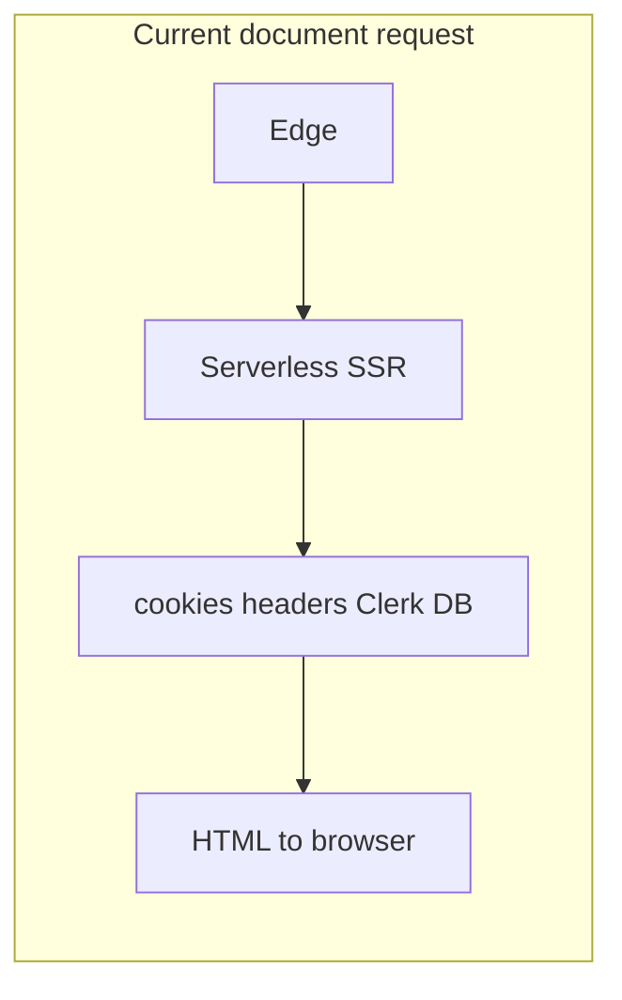

# Vercel cold start and “cache until warm” strategy

## What is actually slow

On Vercel, a **cold** document request pays for: edge routing → spinning up a Node serverless instance → loading your server bundle → running React SSR for the **full tree** that is dynamic.

**First Contentful Paint (FCP)** improves when the browser gets HTML (and critical CSS/fonts) sooner. That requires either **less server work per request** or **a cache hit at the CDN** so the first byte does not wait on a cold Lambda at all.

## Why “improve cache until the execution env was fired” is limited today

The pattern in your screenshot—**`Cache-Control` with `s-maxage` / `stale-while-revalidate`** so the edge serves a cached HTML document while the origin warms—only works when **the cached HTML is correct for the request**.

This app currently makes almost every page **fully dynamic**:

| Layer                                                  | Dynamic APIs                                     | Effect                                                                                                                      |
| ------------------------------------------------------ | ------------------------------------------------ | --------------------------------------------------------------------------------------------------------------------------- |
| [i18n/request.ts](i18n/request.ts)                     | `cookies()`, `headers()`                         | next-intl resolves locale per request; ties into root [app/layout.tsx](app/layout.tsx) via `getLocale()` / `getMessages()`. |
| [app/components/header.tsx](app/components/header.tsx) | `getCachedAuth()` → Clerk `auth()`               | Runs on **every** page inside the root layout.                                                                              |
| [app/page.tsx](app/page.tsx)                           | `getCachedCurrentUser()` → Clerk `currentUser()` | Personalized branch for signed-in users.                                                                                    |

You already set ISR on the home page:

```11:12:app/page.tsx
// ISR: revalidate cached page every 5 minutes
export const revalidate = 300
```

With the above dynamic APIs in the same render path, Next cannot treat the **document** as a shared, edge-cacheable ISR response the way you intend. The server still does per-request SSR work; a cold start still hurts FCP.



## Direction: two complementary tracks

### Track A — Make more of the HTML cacheable or prerendered (real fix for FCP + edge)

**Goal:** Move “who is logged in?” and “locale from cookie/header” out of the **blocking SSR path** for the first paint where possible, or isolate them behind **Suspense** / **client** boundaries so the shell can be static or ISR.

Concrete levers (pick based on product tolerance for flash of default locale vs signed-in UI):

1. **next-intl + static segments**
   - Use the library’s static pattern: call `setRequestLocale` from layouts/pages for known locales and avoid reading `cookies()`/`headers()` in `getRequestConfig` for routes you want static/ISR ([next-intl static rendering docs](https://next-intl.dev/docs/getting-started/app-router/with-i18n-routing)).
   - This is a structural change to [i18n/request.ts](i18n/request.ts) and likely routing (locale prefix vs current single-tree).

2. **Clerk: stop calling `auth()` / `currentUser()` in the root layout path for the whole site**
   - Today [app/layout.tsx](app/layout.tsx) always renders [app/components/header.tsx](app/components/header.tsx), which awaits `auth()`.
   - Prefer **client components** with `<SignedIn>` / `<SignedOut>` or a small client header that reads session after paint, or move heavy auth-dependent UI under `Suspense` with a static fallback, so the **outer document** can be static/ISR for public views.
   - Keep server `auth()` only on **protected** routes or server actions where correctness matters.

3. **Split `/` into public (cacheable) vs authenticated (dynamic)**
   - e.g. static/ISR marketing at `/` and lists at `/home` or `/dashboard` that stay dynamic.
   - Strongest guarantee for edge caching on `/` without leaking one user’s HTML to another.

Until Track A is done, **adding `s-maxage` on `/` is unsafe** (you would risk serving one user’s signed-in HTML from the edge to another visitor).

### Track B — Reduce how often you pay cold start (operational)

1. **Vercel Cron** hitting a lightweight route (e.g. `GET /` or a dedicated `GET /api/warm`) on a 5–15 minute schedule.
   - Does not fix the first real user after a long idle if cron is misaligned, but **cuts median** cold incidents.
   - Config: `vercel.json` crons (document in Vercel Cron docs).

2. **Bundle / init time** (secondary to HTML cache)
   - `@next/bundle-analyzer` on the server graph; trim heavy imports in server components.
   - Aligns with the third bullet in your screenshot.

### Verification

- After changes, use **`next build` output** (and Vercel deployment “Functions” / cache indicators) to confirm which routes are **Static** vs **Dynamic**.
- Re-check **FCP in Vercel Speed Insights** and compare **cached vs cold** in the Vercel dashboard.

## Recommended sequencing

1. **Measure and label**: confirm which routes are dynamic in production build logs (baseline).
2. **Track A (highest ROI)**: reduce dynamic APIs on the critical path for `/` (layout + i18n + Clerk), aiming for partial static shell or ISR for logged-out `/`.
3. **Track B**: add cron warm-up if cold frequency remains unacceptable.
4. **Only then**: add explicit **`Cache-Control`** for HTML on routes proven **non-personalized** (or use Next’s caching semantics that map to `s-maxage` for those routes).

## Files likely to change

- [i18n/request.ts](i18n/request.ts), [app/layout.tsx](app/layout.tsx), [app/components/header.tsx](app/components/header.tsx), [app/page.tsx](app/page.tsx) — dynamic boundary and auth/i18n strategy.
- Optional new [vercel.json](vercel.json) — cron warm-up.
- [next.config.mjs](next.config.mjs) — bundle analyzer (dev-only).

## Note on `proxy.ts`

The repo has [proxy.ts](proxy.ts) exporting `clerkMiddleware`, but there is **no** `middleware.ts` in the workspace snapshot. If production relies on Edge middleware, ensure the entry file name matches Next’s convention (`middleware.ts` at project root); otherwise behavior may differ from what you expect for protected routes.
